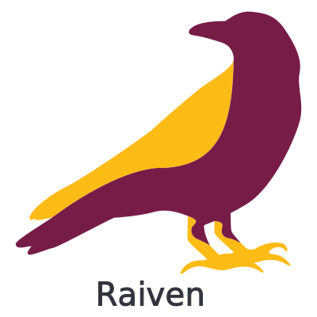

<p align="center">
  
</p>
<p align="center">
  <em>The Radiology Enviroment of the Future</em>
</p>
<p align="center">


</p>

---
Build using python, flask, and nuxt, Raiven is full-featured application for building and maintaining DICOM image processing pipelines.  Raiven hopes to become the radiology room of the future.

Raiven aims to fulfill these [user stories](./stories.md).

## Requirements
Raiven's backend is coded using [fastapi](https://fastapi.tiangolo.com/) and python 3.8. Raiven's frontend is coded 
using [nuxt.js](https://nuxtjs.org) (a vuejs framework) and the [vuetify](https://vuetifyjs.com/) material design framework. 
All the requirements to run raiven can be installed with conda.

```
conda create env
```
**Note:** Raiven requires docker to be installed for the pipelining functionality.

## Deployment
The easiest way to deploy Raiven is using docker.  Raiven comes with a preconfigured compose file.
```bash
docker-compose up -d
```

Development can also be done without docker.  Make sure you first have all the requirements installed.
```bash
# backend
cd backend
python asgi.py

# frontend
cd frontend
npm run build
``` 


## Config
Configuration of Raiven can be done in multiple places. If you are using docker, configuration
can be done by modifying the `.env` file.  Backend configuration can also be done by modifying `/backend/config.py` whilst
the frontend configuration can be done by modifying `/frontend/nuxt.config.js`.  Configuration can also be done by 
setting environment variables.  The environment variables which can be set are found in `/backend/config.py`.

---
<p align="center">
  <em>Proudly Created by <a href="https://qurit.ca">Qurit</a></em>
</p>
<p align="center">
  
</p>

  
