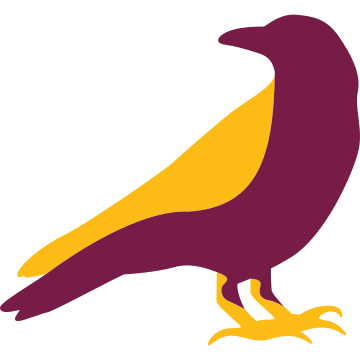

<p align="center">
  
</p>
<p align="center">
    <em>Raiven, the radiology enviroment of the future</em>
</p>

---
Build using python, flask, and nuxt, Raiven is full-featured application for building and maintaining DICOM image processing pipelines.  Raiven hopes to become the radiology room of the future.

Raiven hopes to fulfill these [user stories](./stories.md).

## Development Using Docker
```
docker-compose up --build
```

Performing database migrations within a docker container.
```bash
# Init
docker exec picom_api_1 python manage.py manager init

# Migrate
docker exec picom_api_1 python manage.py manager migrate

# Upgrade
docker exec picom_api_1 python manage.py manager upgrade
```
---
<p align="center">
  <em>Proudly Created by <a href="https://qurit.ca">Quirt</a></em>
</p>
<p align="center">
  
</p>
