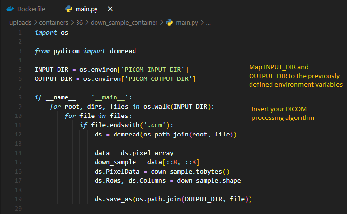

# Containers

## Creating a Container

1. When creating a container, you should have a **Dockerfile** and your **main algorithm**
2. The **Dockerfile** should resemble this example
    * 

    * Install any dependencies you may require and set the environment variables to be **PICOM_INPUT_DIR /mnt/picom/input** and **PICOM_OUTPUT_DIR /mnt/picom/output**
    * Finally, write the instruction to run your **main algorithm** code

3. The **main algorithm** should resemble this example
    * 
    * Map the **INPUT_DIR** to the previously defined **PICOM_INPUT_DIR** and the **OUTPUT_DIR** to the previously defined **PICOM_OUTPUT_DIR**
     Alternatively, if you did not set up the **ENV** variables in the **Dockerfile** , then you can set the **INPUT_DIR** to be **/mnt/picom/input** and the **OUTPUT_DIR** to be **/mnt/picom/output**
    * Insert your DICOM processing algorithm
4. Place both the **Dockerfile** and **main algorithm** in a zippped folder

## Uploading a Container

1. Go to the _Containers_ :material-package-variant-closed: page
2. Fill out the "Add a Container" form
    * You must provide a container name and an attached file
3. Click **Add Container**

## Editing a Container

1. Go to the _Containers_ :material-package-variant-closed: page
2. Click :material-pencil: next to the Container to be edited
    * Alternatively, click :material-delete: to completely delete the container
3. Edit the form
4. Click **Save Edits**
